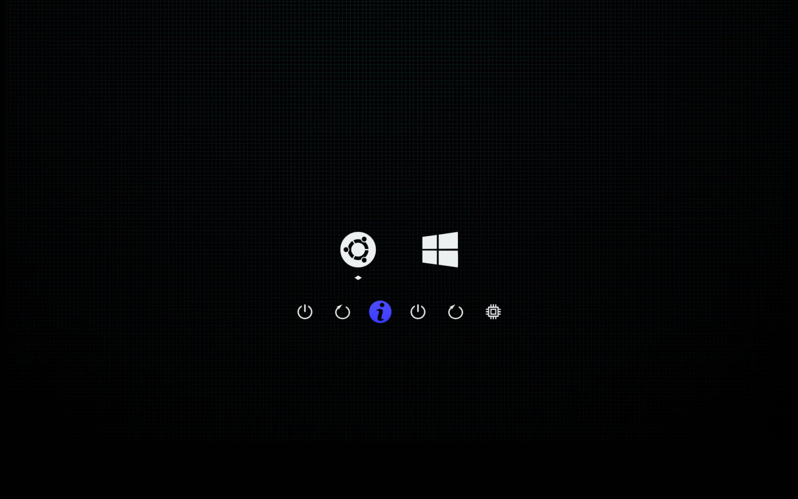

# rEFInd-lite

A minimal, dark theme for the [rEFInd](https://www.rodsbooks.com/refind/) boot manager — built for simplicity. One background. One command to customize. No fuss.

**rEFInd-lite** reuses the complete icon set from [darkmini](https://github.com/LightAir/darkmini) and pairs it with a single, user-friendly background system: a default sci-fi dark background that you can replace with any image using the included `configure.py` tool.



## What rEFInd-lite fixes over traditional themes

| Problem | rEFInd-lite solution |
|---|---|
| Changing the background requires manually copying images and editing config files | `configure.py` does both in one command |
| Images smaller than screen leave ugly solid-color borders | Automatically stretches images to fit your screen exactly |
| Images larger than screen get cropped unpredictably | Automatically resizes (compresses) images to match your screen |

## Quick Start

### 1. Install

Locate your rEFInd EFI directory (commonly `/boot/efi/EFI/refind`) and create a `themes` folder if needed:

```bash
sudo mkdir -p /boot/efi/EFI/refind/themes
```

Copy (or clone) rEFInd-lite into it:

```bash
sudo cp -r rEFInd-lite /boot/efi/EFI/refind/themes/
```

### 2. Configure your background

Run the configuration tool **from inside the OS** (not from the bootloader):

```bash
cd /boot/efi/EFI/refind/themes/rEFInd-lite
pip install Pillow          # one-time dependency
python3 configure.py        # auto-detects resolution, uses default background
```

Or set a custom image:

```bash
python3 configure.py --bg ~/Pictures/my_wallpaper.png
```

Or specify resolution manually (useful for multi-monitor setups):

```bash
python3 configure.py --bg ~/wallpaper.jpg --resolution 1920x1080
```

### 3. Activate the theme

Add this line to the end of your `refind.conf`:

```
include themes/rEFInd-lite/theme.conf
```

Reboot and enjoy.

## Background image notes

- **Supported formats:** PNG, JPG/JPEG, BMP, GIF, WebP, and more (anything [Pillow](https://python-pillow.org/) can read).
- **Resolution matters:** For the sharpest result, use an image whose aspect ratio matches your screen. `configure.py` will stretch it to fit exactly, but matching the ratio avoids distortion.
- **Where to find wallpapers:** [Unsplash](https://unsplash.com/), [Wallhaven](https://wallhaven.cc/), or any image search engine — look for dark, minimal wallpapers at your native resolution (e.g., "1920x1080 dark minimal wallpaper").
- **One background only:** This is by design. rEFInd-lite ships with exactly one default background. You can swap it anytime with `configure.py`.

## File structure

```
rEFInd-lite/
├── theme.conf            # rEFInd theme configuration
├── configure.py           # Background setup tool
├── bg/
│   └── background.png     # Default background (replace with configure.py)
├── icons/                 # 52 OS and function icons (from darkmini)
├── selection_big.png      # Large selection indicator
├── selection_small.png    # Small selection indicator
├── screenshots/           # Screenshots (add yours here!)
├── LICENSE                # MIT
└── README.md
```

## Credits

- **Icons:** All OS and function icons are from [darkmini](https://github.com/LightAir/darkmini) by LightAir, used under the same permissive terms.
- **Selection indicators:** Also from darkmini.
- **Default background:** Custom sci-fi dark background.

## License

MIT — see [LICENSE](LICENSE).

---

# rEFInd-lite（中文说明）

[rEFInd](https://www.rodsbooks.com/refind/) 引导管理器的一款极简暗色主题。**一张背景，一条命令，一切搞定。**

rEFInd-lite 复用了 [darkmini](https://github.com/LightAir/darkmini) 的全部图标，搭配简洁的用户友好背景系统：默认提供一张科技感暗色背景，你可以用自带的 `configure.py` 工具一键替换为任意图片。


## rEFInd-lite 解决了传统主题的哪些痛点

| 痛点 | rEFInd-lite 解决方案 |
|---|---|
| 换背景需要手动复制图片并编辑配置文件 | `configure.py` 一条命令完成 |
| 图片小于屏幕时出现难看的纯色边框 | 自动拉伸至铺满屏幕 |
| 图片大于屏幕时被不可预知地裁切 | 自动压缩以匹配屏幕尺寸 |

## 快速上手

### 1. 安装

找到你的 rEFInd EFI 目录（通常是 `/boot/efi/EFI/refind`），在其中创建 `themes` 文件夹：

```bash
sudo mkdir -p /boot/efi/EFI/refind/themes
```

将 rEFInd-lite 复制进去：

```bash
sudo cp -r rEFInd-lite /boot/efi/EFI/refind/themes/
```

### 2. 配置背景

**在操作系统中**运行配置工具（不是在引导界面中）：

```bash
cd /boot/efi/EFI/refind/themes/rEFInd-lite
pip install Pillow          # 一次性依赖安装
python3 configure.py        # 自动检测分辨率，使用默认背景
```

或者指定自定义图片：

```bash
python3 configure.py --bg ~/Pictures/my_wallpaper.png
```

也可以手动指定分辨率（多显示器环境适用）：

```bash
python3 configure.py --bg ~/wallpaper.jpg --resolution 1920x1080
```

### 3. 启用主题

在 `refind.conf` 末尾添加：

```
include themes/rEFInd-lite/theme.conf
```

重启即可生效。

## 背景图片注意事项

- **支持的格式：** PNG、JPG/JPEG、BMP、GIF、WebP 等（只要是 Pillow 能读的格式即可）。
- **分辨率很重要：** 为了获得最佳显示效果，请使用宽高比与屏幕一致的图片。`configure.py` 会把图片拉伸到铺满屏幕，但如果图片比例和屏幕一致，就不会产生变形。
- **去哪找壁纸：** [Unsplash](https://unsplash.com/)、[Wallhaven](https://wallhaven.cc/) 或任意图片搜索引擎——搜索和你屏幕原生分辨率匹配的暗色极简壁纸（如 "1920x1080 暗色 极简 壁纸"）。
- **只有一张背景：** 这是有意为之的设计。rEFInd-lite 只提供一张默认背景，随时用 `configure.py` 替换。

## 文件结构

```
rEFInd-lite/
├── theme.conf            # rEFInd 主题配置
├── configure.py           # 背景配置工具
├── bg/
│   └── background.png     # 默认背景（用 configure.py 替换）
├── icons/                 # 52 个系统和功能图标（来自 darkmini）
├── selection_big.png      # 大号选择指示器
├── selection_small.png    # 小号选择指示器
├── screenshots/           # 截图目录（请添加你的截图！）
├── LICENSE                # MIT 许可证
└── README.md
```

## 鸣谢

- **图标：** 全部系统及功能图标来自 [darkmini](https://github.com/LightAir/darkmini)（作者 LightAir），沿用相同的宽松许可条款。
- **选择指示器：** 同样来自 darkmini。
- **默认背景：** 自制科技感暗色背景。

## 许可证

MIT — 详见 [LICENSE](LICENSE)。
